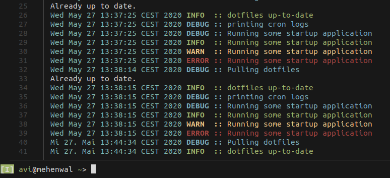
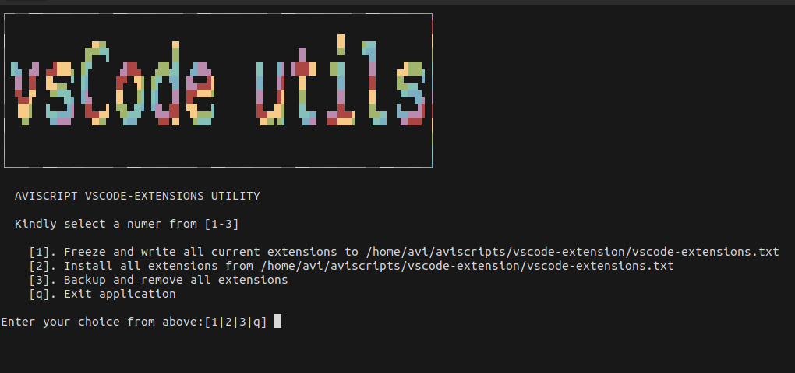

# :sunglasses: AVI Scripts

> Collection of my custom scripts to keep me organized

Projects    | Description
------------|:-------------
:diamond_shape_with_a_dot_inside:	vscode-extension    | backup, restore and track your favourite vscode extensions
:diamond_shape_with_a_dot_inside:   on_startup_script   | Automatically update dotfiles on startup
:diamond_shape_with_a_dot_inside: convert_fish_abbr_2_bash_alias | Generate and update zsh alias on startup
:currency_exchange: Changelog | git based changelog script tobe used in md format

## :horse: Issues / todos

* [ ] Log to/from different Files, like neo4j
* [ ] Add scriptname to logs

## :cherry_blossom: Future Work

* [ ] [Shell compiler](https://en.wikipedia.org/wiki/Shc_the_shell_script_compiler)

## :orange: References

* [Useless Use of Cat Award](https://archive.is/G9FTL)
* [Execute a command once per line of piped input?](https://unix.stackexchange.com/questions/7558/execute-a-command-once-per-line-of-piped-input)

#### :v: Get in touch with me

> I am looking for Jobs ... :sunglasses:

* [Github](https://github.com/avimehenwal/)
* [My Website](https://avimehenwal.in)
* [My Blog v2](https://avimehenwal2.netlify.app/)
* [Twitter Handle](https://twitter.com/avimehenwal)
* [LinkedIn](https://in.linkedin.com/in/avimehenwal)
* [Stackoverflow](https://stackoverflow.com/users/1915935/avi-mehenwal)

 Spread Love :hearts: and not :no_entry_sign: hatred   